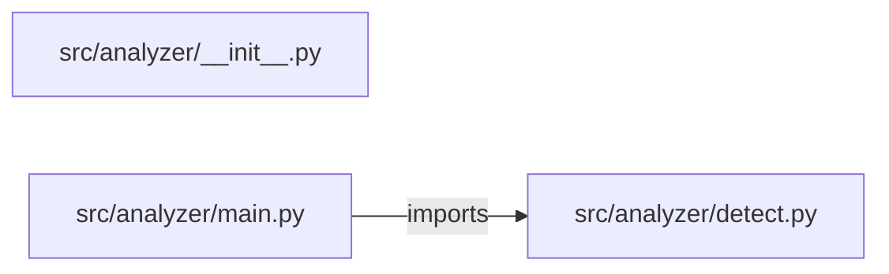

# system-health-log-analyzer — project architecture

[README](README.md) · [Interview questions and answers](INTERVIEW_QA.md)

## Purpose and scope

CPU, memory, disk plus application logs → anomaly flags → REST. Nothing is paged.

This document describes files and symbols in this checkout. Deployment templates and statements in the original overview are distinguished from a verified running environment.

## Component diagram



For Python repositories, arrows show resolved local imports, not network calls or deployment order. Otherwise the diagram is a repository component map; containment arrows do not assert runtime integration.

## Components and responsibilities

| Component | Responsibility |
| --- | --- |
| [`src/analyzer/main.py`](src/analyzer/main.py) | HTTP handlers: `GET /healthz`, `POST /ingest`, `GET /alerts` |
| [`src/analyzer/detect.py`](src/analyzer/detect.py) | Functions: `ingest`, `alerts` |
| [`requirements.txt`](requirements.txt) | Implementation or supporting configuration |
| [`src/analyzer/__init__.py`](src/analyzer/__init__.py) | Implementation or supporting configuration |
| [`tests/test_analyzer.py`](tests/test_analyzer.py) | Executable checks and regression examples |
| [`.github/workflows/ci.yml`](.github/workflows/ci.yml) | GitHub Actions job definitions |
| [`README.md`](README.md) | Project explanations or operating notes |

## Request interface

| Method and path | Handler | Source |
| --- | --- | --- |
| `GET /healthz` | `healthz` | [`src/analyzer/main.py`](src/analyzer/main.py#L6) |
| `POST /ingest` | `post_ingest` | [`src/analyzer/main.py`](src/analyzer/main.py#L10) |
| `GET /alerts` | `get_alerts` | [`src/analyzer/main.py`](src/analyzer/main.py#L17) |

The table lists literal route decorators found in the inspected Python modules. Router prefixes and middleware can add behavior; check the linked handler and application setup before calling an endpoint.

## Implementation walkthrough

### `ingest(snapshot, logs)`

Source: [`src/analyzer/detect.py`](src/analyzer/detect.py#L9).

Calls visible in this function: `ERROR_RE.search`, `HISTORY.append`, `InputError`, `alerts.append`, `enumerate`, `hits.append`, `isinstance`, `len`, `snapshot.get`.

```python
def ingest(snapshot, logs):
    if not isinstance(snapshot, dict):
        raise InputError("snapshot required")
    alerts = []
    for key in ("cpu_percent", "memory_percent", "disk_percent"):
        value = snapshot.get(key)
        if value is None:
            continue
        if not isinstance(value, (int, float)) or isinstance(value, bool) or not 0 <= value <= 100:
            raise InputError(f"{key} must be 0-100")
        if value >= 90:
            alerts.append({"kind": key, "level": "critical", "value": value})
        elif value >= 80:
            alerts.append({"kind": key, "level": "warn", "value": value})
    hits = []
    for i, line in enumerate(logs or []):
        if isinstance(line, str) and ERROR_RE.search(line):
            hits.append({"line": i, "text": line[:240]})
    if len(hits) >= 3:
        alerts.append({"kind": "log_burst", "level": "warn", "value": len(hits)})
    rec = {"alerts": alerts, "log_hits": hits, "paged": False}
    HISTORY.append(rec)
```

The excerpt is truncated; the linked source contains the full implementation.

### `alerts()`

Source: [`src/analyzer/detect.py`](src/analyzer/detect.py#L33).

Calls visible in this function: `len`.

```python
def alerts():
    return {"alerts": [a for rec in HISTORY for a in rec["alerts"]], "samples": len(HISTORY), "paged": False}
```

## Validation and failure paths

| Explicit exception | Source |
| --- | --- |
| `InputError('snapshot required')` | [`src/analyzer/detect.py`](src/analyzer/detect.py#L11) |
| `InputError(f'{key} must be 0-100')` | [`src/analyzer/detect.py`](src/analyzer/detect.py#L18) |
| `HTTPException(status_code=422, detail=str(exc))` | [`src/analyzer/main.py`](src/analyzer/main.py#L14) |

These are explicit exceptions in the inspected source, rather than a claim that every failure is handled. Follow the calling handler to see whether the exception becomes an HTTP response or propagates.

## Data flow and design decisions

### What is the input-to-output contract of `ingest`

In [`src/analyzer/detect.py`](src/analyzer/detect.py#L9), `ingest(snapshot, logs)` receives the inputs. The function computes these intermediate values:

- `alerts = []`
- `hits = []`
- `rec = {'alerts': alerts, 'log_hits': hits, 'paged': False}`

Its result is defined by:

- `rec`

### Which decision rules or boundary conditions should an interviewer challenge

The implementation in [`src/analyzer/detect.py`](src/analyzer/detect.py#L9) branches on:

- `not isinstance(snapshot, dict)`
- `len(hits) >= 3`
- `value is None`
- `not isinstance(value, (int, float)) or isinstance(value, bool) or (not 0 <= value <= 100)`
- `value >= 90`
- `isinstance(line, str) and ERROR_RE.search(line)`
- `value >= 80`

A useful extension is a table-driven test that covers each condition just below, at, and above its boundary where applicable. These expressions are the current rules; changing them changes behavior and should be justified by the project’s acceptance criteria.

## Setup and verification

The following commands are derived from the checked-in dependency/test contracts. Execute them from the repository root; the block prepares a local environment, not a cloud deployment.

```bash
python3 -m venv .venv
source .venv/bin/activate
python -m pip install -r requirements.txt
python -m pytest -q
```

Python dependencies: [`requirements.txt`](requirements.txt).

Test entry points: [`tests/test_analyzer.py`](tests/test_analyzer.py).

Automation definitions: [`.github/workflows/ci.yml`](.github/workflows/ci.yml). Read their triggers and job steps to determine what CI actually runs.

## Operating boundaries and design review

Before turning this checkout into a customer deployment, establish the input contract, data ownership, access controls, failure response, evaluation criteria, and rollback owner. Repository fixtures and unit tests demonstrate local behavior; they do not establish throughput, uptime, compliance, or business impact.

A useful architecture review starts with the linked implementation: identify where input enters, where a decision is made, which state can change, and which external dependency can fail. Add a deployment view only for infrastructure that is actually configured and exercised.
